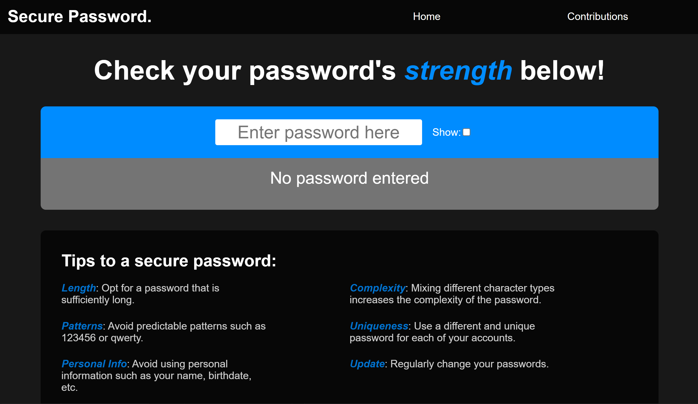

# Password Strength Checker

A password strength checker app built with React, Vite, React Router DOM, and Styled Components.



## Features

- Password strength evaluation based on complexity criteria
- Toggle password visibility to check input
- General tips for creating secure passwords
- Two routes: Home and Contributions

## Demo

You can try the live demo of the app [here](https://example.com).

## Installation

1. Clone the repository:

```bash
git clone https://github.com/CamSteph/password-strength-checker.git
```

2. Navigate to the project directory:

```bash
cd password-strength-checker
```

3. Install the dependencies

```bash
npm install
```

## Usage

1. Start the development server:
```bash
npm run dev
```

2. Open your browser and visit `http://localhost:<port>` to access the app. Ex: `http://localhost:5173`

## Screenshots

Coming soon

## Technologies Used

- React
- Vite
- React Router DOM
- Styled Components

## Contributing

Contributions are welcome! If you have any ideas, suggestions, or bug reports, please open an issue or submit a pull request.
